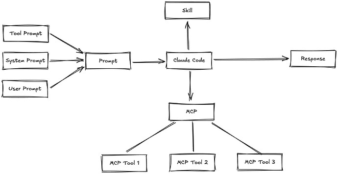
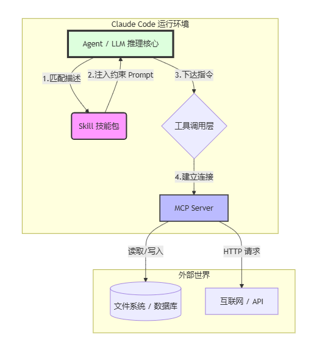

# 名词解释

- Token，词元，大模型输入输出的基础单位。例如，“我，喜欢，吃，苹果”
- Prompt，提示词，它的质量决定代码输出的质量。也是重中之重
- SKILL，动态加载的外置 Prompt，常见：superpowers（AI编程工作流）、frontend-design（前端去AI味）、skill-creator 等
- MCP，大模型与外部服务的标准化接口。常见：Context7（获取最新官方文档）、Playwright（模拟浏览器操作）等

| 维度       |    **Skill (技能包)**     |          **MCP (工具协议)** |
| ---------- | :-----------------------: | --------------------------: |
| 形象类比   |          说明书           |                        管道 |
| 核心本质   | 动态加载的**外置 Prompt** |      跨服务的**标准化接口** |
| 解决的问题 | 减少上下文干扰，精准约束  |    解决"手短"问题，连接数据 |
| 存在形态   |  .md 格式的指令集 + 描述  | 运行在本地/远程的工具服务器 |
# 推理过程

