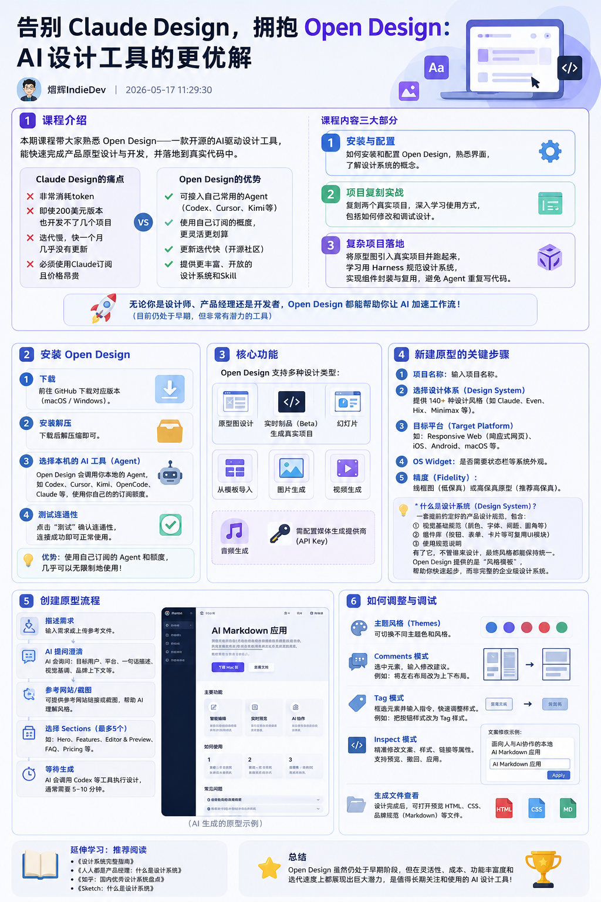

# 设计系统迁移：temp/ → Next.js

> **状态：待整理**

## 背景

将 `temp/` 目录下的原生 HTML 文件中的设计系统与页面样式，完整还原到当前 Next.js 项目中。要求视觉、布局、间距、颜色、字体、交互状态尽可能一致。

---

## 一、设计系统提取

先分析 `temp/` 中的 HTML/CSS 结构，提取可复用的设计系统：

### 1.1 设计变量（Design Tokens）

- 颜色
- 字体
- 间距
- 圆角
- 阴影

### 1.2 通用组件

- Button
- Card
- Input
- Navigation
- Layout

### 1.3 页面级布局与响应式规则

---

## 三、AGENTS.md 文档

编写 `AGENTS.md` 文件，包含以下内容：

1. 项目整体介绍
2. 前端目录结构
3. 设计系统架构
4. 组件复用规范
5. 后续开发注意事项

---

## 四、设计系统预览页面

新增一个「设计系统预览」页面：

| 属性   | 说明                     |
| ---- | ---------------------- |
| 访问范围 | 仅开发环境可查看               |
| 渲染方式 | 纯前端渲染                  |
| 展示内容 | 颜色、字体、按钮、卡片、表单、布局等核心组件 |
| 用途   | 验证组件复用效果和样式还原质量        |

---

## 五、最终目标

1. 将 `temp/` 中的前端完整还原到当前 Next.js 项目中
2. 将 `temp/` 中的前端迁移为 Next.js 项目中的**可维护、可复用、可扩展**的前端组件体系

该文件描述了一个设计系统迁移任务：将 `temp/` 目录中的原生 HTML 页面与样式，完整且高保真地还原到当前 Next.js 项目中，并构建可维护、可复用、可扩展的前端组件体系。

**核心内容：**
- **设计提取**：从旧文件中分析并提炼颜色、字体、间距等设计变量，抽象出 Button、Card、Input 等通用组件及页面级布局规则。
- **架构规范**：强调组件复用优先，避免重复样式；通过 props、variant 等方式扩展已有组件，仅在无法满足需求时才新增。
- **文档编制**：编写 `AGENTS.md`，包含项目介绍、目录结构、设计系统架构、组件复用规范及开发注意事项。
- **预览页面**：新增一个仅在开发环境可见的设计系统预览页，用于验证组件和样式的还原质量。
- **最终目标**：实现从旧代码到 Next.js 的完整迁移，输出一套可维护、可复用的前端组件系统。